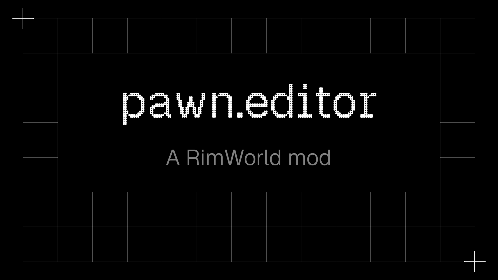

Complete rewrite of Pawn Editor. The original I was too unfamiliar with and had some core issues in my opinion that needed fixing. This current branch is not stable and/or intended to use in a playthrough. The rewrite has the following goals:

1. Split different editing categories into sections, exposed to xml. This introduces to following advantages:

- We can use `IfModActive` in xml for mod support.
- Sections can be patched in or out.

2. Improved mod support. Since this time I have written all code myself it should be easier to add onto it.
3. Layout engine. Easy layout for multiple sections, adapts to whether or not sections are rendered for a Pawn.
